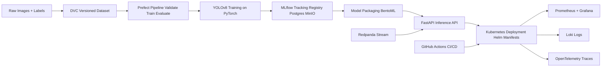

# Local MLOps Demo (Computer Vision, YOLOv8)

A beginner-to-intermediate, **hands-on** MLOps tutorial for local laptops using only open-source tools.

Use case: lightweight object detection (barcode/box-like synthetic dataset + optional real dataset).

---

## 1) High-Level Architecture



---

## 2) Why each tool?

- **Podman / Podman Compose**: Docker-compatible local containers, daemonless.
- **kind**: lightweight local Kubernetes cluster using container nodes.
- **Helm**: reusable app packaging/deploy patterns.
- **PyTorch + YOLOv8**: approachable object detection training.
- **MLflow**: experiments + model registry.
- **Prefect**: local-first orchestration (simple flow authoring).
- **DVC**: dataset and model versioning in Git workflows.
- **MinIO + PostgreSQL**: artifact/object storage + metadata DB.
- **FastAPI + BentoML**: practical API serving and packaging style.
- **Prometheus/Grafana/Loki/OTel**: metrics, dashboards, logs, traces.
- **Redpanda**: lightweight Kafka-compatible streaming.
- **Terraform**: IaC patterns (local Kubernetes resources via providers).
- **GitHub Actions**: CI/CD automation patterns.

---

## 3) Prerequisites

- macOS/Linux laptop (8 GB RAM minimum, 16 GB recommended)
- Python 3.11+
- Git
- Podman 5+
- podman-compose
- kubectl
- kind
- helm
- dvc
- terraform
- uv

### Install (macOS example)

```bash
brew install podman podman-compose kubectl kind helm dvc terraform uv
podman machine init
podman machine start
```

Verify:

```bash
podman --version
podman-compose --version
kubectl version --client
kind version
helm version
dvc --version
terraform --version
uv --version
```

---

## 4) Local environment setup

```bash
git init
uv venv
source .venv/bin/activate
uv pip install -r requirements.txt
```

Configure local env:

```bash
cp .env.example .env
```

---

## 5) Project structure

```text
mlops-demo/
├── app/
├── pipelines/
├── models/
├── datasets/
├── infrastructure/
├── kubernetes/
├── monitoring/
├── scripts/
├── tests/
├── .github/workflows/
├── podman-compose.yml
├── Makefile
└── README.md
```

---

## 6) Start local platform services (Podman Compose)

```bash
make infra-up
```

Services:
- MinIO: <http://localhost:9001>
- PostgreSQL: localhost:5432
- MLflow: <http://localhost:5001>
- Prefect API: <http://localhost:4200>
- Redpanda: localhost:9092

Create MinIO bucket:

```bash
make minio-bootstrap
```

---

## 7) Dataset ingestion + validation + DVC versioning

Generate tiny synthetic barcode/box dataset (fast for laptops):

```bash
make data-generate
make data-validate
```

Track with DVC:

```bash
make dvc-init
make dvc-track
```

> Optional: replace `datasets/raw` with a tiny Roboflow/Open Images sample and keep same label format.

---

## 8) Train YOLOv8 (CPU/GPU)

```bash
make train
```

GPU note:
- If CUDA is available, Ultralytics auto-detects GPU.
- Otherwise, this tutorial defaults to CPU-safe tiny training.

Training logs and metrics go to MLflow.

---

## 9) Pipeline orchestration (Prefect)

Run full flow:

```bash
make pipeline-run
```

Flow steps:
1. validate dataset
2. train YOLOv8 model
3. register model metadata in MLflow
4. export service-ready artifact

---

## 10) Model registry usage (MLflow)

- Open MLflow UI: <http://localhost:5001>
- Promote models by stage (`Staging` -> `Production`) in UI.

Command-line registration helper:

```bash
python scripts/register_model.py --run-id <RUN_ID> --name yolo-barcode-detector
```

---

## 11) Serve model locally (FastAPI + BentoML)

```bash
make serve-local
# test
curl -X POST "http://localhost:8000/predict" -F "file=@datasets/raw/images/sample_0.jpg"
```

---

## 12) Kubernetes local cluster setup

```bash
make k8s-create
make k8s-deploy
```

This installs:
- app deployment/service
- Prometheus/Grafana/Loki (lightweight local stack)

Check:

```bash
kubectl get pods -A
kubectl get svc -n mlops-demo
```

---

## 13) Helm deployment

```bash
helm upgrade --install mlops-demo ./infrastructure/helm/mlops-demo -n mlops-demo --create-namespace
```

Production pattern: use Helm values for environment-specific overrides (dev/staging/prod).

---

## 14) Observability setup

### Metrics (Prometheus)
- FastAPI exposes `/metrics` via `prometheus-fastapi-instrumentator`.

### Dashboards (Grafana)
- Add Prometheus + Loki datasources.
- Import sample dashboard JSON from `monitoring/grafana-dashboard.json`.

### Logs (Loki)
- Promtail collects Kubernetes logs and forwards to Loki.

### Traces (OpenTelemetry)
- API emits traces to OTel Collector.
- Collector exports to logging by default (local-friendly).

---

## 15) Streaming inference (Redpanda)

Producer sends image event messages:

```bash
python scripts/produce_events.py
```

Consumer in API (optional) reads events and triggers prediction pipeline pattern.

---

## 16) CI/CD (GitHub Actions)

Workflow: `.github/workflows/ci-cd.yaml`
- lint + tests
- train smoke check
- build image with Podman
- (optional) deploy to local K8s/self-hosted runner

---

## 17) Drift detection basics

Run baseline drift check (size/brightness proxy stats):

```bash
python scripts/drift_check.py --reference datasets/processed/reference_stats.json --current datasets/processed/current_stats.json
```

Production pattern: replace proxies with embedding/statistical drift libraries (Evidently, NannyML).

---

## 18) Canary deployment basics

Apply canary manifests:

```bash
kubectl apply -f kubernetes/base/canary.yaml
```

Pattern shown:
- stable deployment: 90%
- canary deployment: 10%
- switch traffic by adjusting service selectors/weights (service-mesh recommended in production).

---

## 19) Rollback example

```bash
kubectl rollout history deployment/mlops-api -n mlops-demo
kubectl rollout undo deployment/mlops-api -n mlops-demo
```

Helm rollback:

```bash
helm history mlops-demo -n mlops-demo
helm rollback mlops-demo 1 -n mlops-demo
```

---

## 20) Complete execution walkthrough

```bash
make setup
make infra-up
make minio-bootstrap
make data-generate
make data-validate
make dvc-init
make dvc-track
make train
make pipeline-run
make serve-local
make k8s-create
make k8s-deploy
```

---

## Common beginner mistakes

- Not starting `podman machine` before compose commands.
- Forgetting `.env` values for S3/MLflow.
- Training with huge datasets locally (slow, memory pressure).
- Skipping DVC, then losing dataset reproducibility.
- No health/readiness probes in Kubernetes.
- No rollback plan before canary/testing.

---

## Troubleshooting

- **Podman socket issues**: restart `podman machine`.
- **MLflow can't write artifacts**: verify MinIO bucket and env vars.
- **K8s image pull fails**: load image into kind (`kind load docker-image ...`) or use local registry.
- **Grafana empty dashboards**: check Prometheus scrape target `/metrics`.
- **Redpanda connection errors**: verify `localhost:9092` mapped and broker up.

---

## Scaling recommendations

- Move MinIO/Postgres to managed services in cloud.
- Use remote DVC storage and object lifecycle policies.
- Add model approval gates in CI/CD.
- Replace basic canary with service mesh (Istio/Linkerd + progressive delivery).
- Add feature store and richer drift/quality monitoring.

---

## Next learning steps

- Add automated retraining triggers from drift alerts.
- Introduce KServe for model serving on Kubernetes.
- Add vector/embedding monitoring for vision models.
- Expand to multi-model A/B experimentation.
